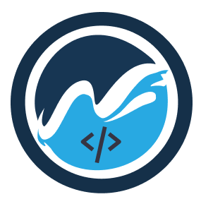

<p align="center">
  
</p>

<h1 align="center">OpenLake Website</h1>

<p align="center">
  The official website for <strong>OpenLake</strong> — an open-source community where students learn, build, and ship impactful projects together.
</p>

---

## 🚀 About

This repository powers the official OpenLake website, built with **Next.js**.

It serves as the central hub for:
- 🌊 OpenLake community
- 💻 Open-source projects
- 📚 Learning resources
- 🎯 Events and initiatives
- 🤝 Student collaboration

---

## 🛠️ Development

### 1. Clone the repository

```sh
git clone https://github.com/openlake/openlake-website.git
```

### 2. Install dependencies

```sh
bun install
```

### 3. Start the development server

```sh
bun dev
```

The site will be available at:

```
http://localhost:3000
```

---

## 🧰 Tech Stack

- Next.js
- React
- TypeScript
- Tailwind CSS
- Bun

---

## 🤝 Contributing

We welcome contributions from students, developers, designers, and open-source enthusiasts.

If you'd like to contribute:

1. Fork the repository
2. Create a new branch
3. Make your changes
4. Submit a Pull Request

Please keep PRs focused and descriptive.

---

## ❤️ OpenLake

OpenLake is a student-driven open-source community where builders come together to learn, create, and contribute to meaningful projects.

Whether you're writing your first line of code or maintaining production software, there's a place for you here.

---

<p align="center">
Made with ❤️ by the OpenLake community.
</p>